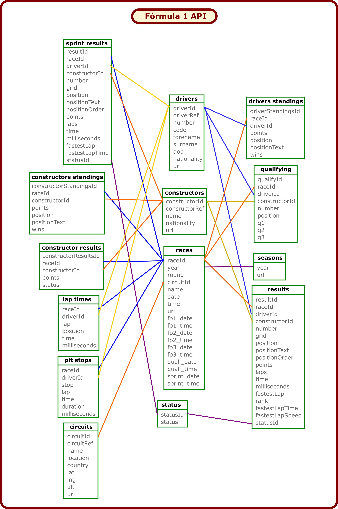
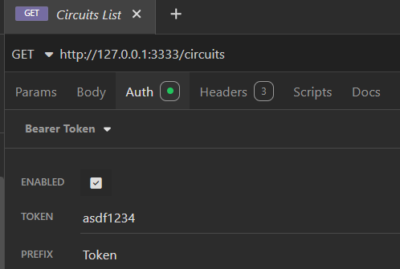

# API Fórmula 1

> **Modificado por:** Fabio Toledo Bonemer De Salvi para o bootcamp da DIO meu tudo Mobile Developer.\
> **Versão base:** Felipe Aguiar - Instrutor na DIO.\
> **Objetivo:** Desenvolver uma API minimalista utilizando o Node.js com o framework fastify.

## Descrição

A API Fórmula 1 é uma aplicação inspirada no site oficial  da principal categoria de corrida de carros, o [Fórmula 1](https://www.formula1.com), e tem como objetivo fornecer e amazenar informações referentes às corridas e pilotos para serem utilizadas por desenvolvedres de front-ends, gerar estatísticas e outros propósitos similares.\
A base de dados utilizada para esta aplicação possui dados referêntes ao perído de 1950 a meados de 2024, sendo necessário a sua atualização por conta do projeto ter sido descontinuado. Os dados do projeto Ergast-F1 no formato CSV esta dispnível [neste link](https://www.kaggle.com/datasets/rohanrao/formula-1-world-championship-1950-2020).\
Utilize a api do projeto [Jolpica-F1](https://api.jolpi.ca/ergast/f1/) para obter os dados atualizados da Fórmula 1 a partir 1950 até os dias de hoje.\

## Funcionalidades implementadas por Fabio Toledo Bonemer De Salvi

Com a **API Fórmula 1** é possível utilizar os métodos **GET** (buscar), **POST** (inserir), **PUT** (inserir ou editar), **PATCH** (editar parcialmente) e **DELETE** (apagar) para manipular as seguintes informações:

- **Circuitos *(Circuits)*:** Informações referente aos ciruitos como nome, localização, país, latitude, longitude e altitude.
- **Construtores *(Constructors)*:** Informações referente aos construtores como nme e nacionalidade.
- **Corridas *(Races)*:** Informações referente às corridas como data, hora e circuito.
- **Classificação de construtores *(Constructors standings)*:** Informações referente à classificação de construtores como pontos, nome e nacinalidade.
- **Classificação de pilotos *(Drivers standings)*:** Informações referente à classificação dos pilotos como pontos, posição e vitórias.
- **Paradas nos boxes *(pit stops)*:** Informações referente as tempos de cada para nos boxes.
- **Pilotos *(Drivers)*:** Informações referente as pilotos como nome, numero e nacinalidade.
- **Qualificação *(Qualifying)*:** Informações referente a qualificação como corrida, piloto, construtor, numero, posição e tempos.
- **Resultados dos construtores *(Constructors results)*:** Informações referente as contrutores como corrida, construtor, pontos e status.
- **Resultados das corridas *(Results)*:** Informações referente à corrida principal. Reune informações do piloto, do construtor, corrida e status e agrega as informações de tempo, volta rápida, posição no grid e classificação.
- **Resultados das corridas sprint *(Sprint results)*:** Informações referente à corrida rápida realizada um dia antes da corrida principal. Reune informações do piloto, do construtor, corrida e status e agrega as informações de tempo, volta rápida e posição no grid.
- **Status *(Status)*:** Informações diversas.
- **Tempos de volta *(Tempos de volta)*:** Informações referente as tempos das voltas para cada corrida.
- **Temporadas *(Temporadas)*:** Infrmações referente às temporadas.


As informações da API são inicialmente carregas de arquivos CSV e armazenadas em arquivos JSON.
Após os arquivos JSON serem gerados, todas as alterações nos dados realizadas pela API serão salvas nestes arquivos JSON.\
Algumas tabelas possuem chave composta para armazenar os dados.\
Deve-se seguir a seguinte relação entre as tabelas ao acessar ou modificar as informações:



## Implementação

### Envio e recebimento de requisições REST 

Utilize softwares que gerenciam requisições http, como **Postman** ou **Insomnia**, para enviar e receber as requisições **GET**, **POST**, **PUT**, **PATCH** e **DELETE** para a API.
O formato do tipo de dados enviado no corpo (**Body**) da requisição deve ser o tipo **JSON**.
A API verifica o parametro **Bearer Token** para concluir as solicitações.

### Configure o Bearer Token no cabeçalho da requisição REST

Configure o **Bearer Token** dentro de **Auth**, localizado no cabeçalho (**heading**) da requisição.\
A figura abaixo ilustra a configuração do token de segurança no software **Insomnia**.\
\
Todas as requisições precisam ser enviadas com o **Bearer Token** configurado:
- **TOKEN:** asdf1234
- **PREFIX:** Token
Se o **Bearer Token** não for enviado é retornado o código **401 UNAUTHORIZED** com a mensagem **Missing Bearer Token**.
Já para o **Bearer Token** enviado incorretamente é retornado o código **401 UNAUTHORIZED** com a mensagem **Bearer Token wrong**.


### Resuisição GET (List)

A requisição **GET** retorna um objeto contendo na chave (*key*) o nome da base de dados que foi requisitado e no campo valor (*value*) retorna um vetor com os registros encontrados nesta base de dados.\
Se houver registros é retornado o código **200 OK**.\
Caso não houver registros é retornado o código **404 NOT FOUND**.\
Pode-se utilizar a ***query string***, formada pelos ***quey parameters***, para selecinar os registros a serem retornados.\
A ***query string*** é enviada na **URL** após o símbolo **?**.\
Também pose-se utilizar a busca por um determinado **Id** utlizando o **endpoint** juntamente com o **Id** do registro desejado.\
As três abordagens de requisição de dados estão exemplificadas abaixo.


### 
- **Base de dados**

    - **Circuitos:**
        - **Endpoint:**\
            `GET /circuits`
        - **Resposta:**\
            `200 OK` (Apenas o primeiro item)
            ```JSON
            {
                "circuits": [
                    {
                        "circuitId": 1,
                        "circuitRef": "albert_park",
                        "name": "Albert Park Grand Prix Circuit",
                        "location": "Melbourne",
                        "country": "Australia",
                        "lat": -37.8497,
                        "lng": 144.968,
                        "alt": 10,
                        "url": "http://en.wikipedia.org/wiki/Melbourne_Grand_Prix_Circuit"
                    },
                    ...
                ]
            }        
            ```

    - **Construtores:**
        - **Endpoint:**\
            `GET /constructors`    
        - **Resposta:**\
             `200 OK` (Apenas o primeiro item)
            ```JSON
            {
                "constructors": [
                    {
                        "constructorId": 1,
                        "constructorRef": "mclaren",
                        "name": "McLaren",
                        "nationality": "British",
                        "url": "http://en.wikipedia.org/wiki/McLaren"
                    },
                    ...
                ]
            }        
            ```

    - **Corridas:**
        - **Endpoint:**\
            `GET /races`
        - **Resposta:**\
            `200 OK` (Apenas o primeiro item)        
            ```JSON
            {
                "races": [
                    {
                        "raceId": 1,
                        "year": 2009,
                        "round": 1,
                        "circuitId": 1,
                        "name": "Australian Grand Prix",
                        "date": "2009-03-29",
                        "time": "06:00:00",
                        "url": "http://en.wikipedia.org/wiki/2009_Australian_Grand_Prix",
                        "fp1_date": "",
                        "fp1_time": "",
                        "fp2_date": "",
                        "fp2_time": "",
                        "fp3_date": "",
                        "fp3_time": "",
                        "quali_date": "",
                        "quali_time": "",
                        "sprint_date": "",
                        "sprint_time": ""
                    },
                    ...
                ]
            }            
            ```

    - **Classificação de construtores:**
        - **Endpoint:**\
            `GET /constructor/standings`    
        - **Resposta:**\
            `200 OK` (Apenas o primeiro item)
            ```JSON
            {
                "constructorStandings": [
                    {
                        "constructorStandingsId": 1,
                        "raceId": 18,
                        "constructorId": 1,
                        "points": 14,
                        "position": 1,
                        "positionText": "1",
                        "wins": 1
                    },
                    ...
                ]
            }
            ```

    - **Classificação de pilotos:**
        - **Endpoint:**\
        `   GET /driver/standigs`
        - **Resposta:**\
            `200 OK` (Apenas o primeiro item)
            ```JSON
            {
                "driverStandings": [
                    {
                        "driverStandingsId": 1,
                        "raceId": 18,
                        "driverId": 1,
                        "points": 10,
                        "position": 1,
                        "positionText": "1",
                        "wins": 1
                    },
                    ...
                ]
            }            
            ```

    - **Paradas nos boxes:**
        - **Endpoint:**\
            `GET /pit/stops`
        - **Resposta:**\
            `200 OK` (Apenas o primeiro item)        
            ```JSON
            {
                "pitStops": [
                    {
                        "raceId": 841,
                        "driverId": 1,
                        "stop": 1,
                        "lap": 16,
                        "time": "17:28:24",
                        "duration": "23.227",
                        "milliseconds": 23227
                    },
                    ...
                ]
            }            
            ```

    - **Pilotos:**
        - **Endpoint:**\
            `GET /drivers`
        - **Resposta:**\
            `200 OK` (Apenas o primeiro item)        
            ```JSON
            {
                "drivers": [
                    {
                        "driverId": 1,
                        "driverRef": "hamilton",
                        "number": 44,
                        "code": "HAM",
                        "forename": "Lewis",
                        "surname": "Hamilton",
                        "dob": "1985-01-07",
                        "nationality": "British",
                        "url": "http://en.wikipedia.org/wiki/Lewis_Hamilton"
                    },
                    ...
                ]
            }
            ```

    - **Qualificação:**
        - **Endpoint:**\
            `GET /qualifyings`
        - **Resposta:**\
            `200 OK` (Apenas o primeiro item)        
            ```JSON
            {
                "qualifys": [
                    {
                        "qualifyId": 1,
                        "raceId": 18,
                        "driverId": 1,
                        "constructorId": 1,
                        "number": 22,
                        "position": 1,
                        "q1": "1:26.572",
                        "q2": "1:25.187",
                        "q3": "1:26.714"
                    },
                    ...
                ]                
            }            
            ```

    - **Resultados dos construtores:**
        - **Endpoint:**\
            `GET /constructor/results`   
        - **Resposta:**\
            `200 OK` (Apenas o primeiro item)        
            ```JSON
            {
                "constructorResults": [
                    {
                        "constructorResultsId": 1,
                        "raceId": 18,
                        "constructorId": 1,
                        "points": 14,
                        "status": ""
                    },
                    ...
                ]
            }    
            ```

    - **Resultado das corridas:**
        - **Endpoint:**\
            `GET /results`
        - **Resposta:**\
            `200 OK` (Apenas o primeiro item)        
            ```JSON
            {
                "results": [
                    {
                        "resultId": 1,
                        "raceId": 18,
                        "driverId": 1,
                        "constructorId": 1,
                        "number": 22,
                        "grid": 1,
                        "position": 1,
                        "positionText": "1",
                        "positionOrder": 1,
                        "points": 10,
                        "laps": 58,
                        "time": "1:34:50.616",
                        "milliseconds": 5690616,
                        "fastestLap": 39,
                        "rank": 2,
                        "fastestLapTime": "1:27.452",
                        "fastestLapSpeed": "218.300",
                        "statusId": 2
                    },
                    ...
                ]
            }            
            ```

    - **Resultado das corridas sprint:**
        - **Endpoint:**\
            `GET /sprint/results`
        - **Resposta:**\
            `200 OK` (Apenas o primeiro item)        
            ```JSON
            {
                "sprintResults": [
                    {
                        "resultId": 1,
                        "raceId": 1061,
                        "driverId": 830,
                        "constructorId": 9,
                        "number": 33,
                        "grid": 2,
                        "position": 1,
                        "positionText": "1",
                        "positionOrder": 1,
                        "points": 3,
                        "laps": 17,
                        "time": "25:38.426",
                        "milliseconds": 1538426,
                        "fastestLap": 14,
                        "fastestLapTime": "1:30.013",
                        "statusId": 1
                    },
                    ...
                ]
            }            
            ```

    - **Status:**
        - **Endpoint:**\
            `GET /status`
        - **Resposta:**\
            `200 OK` (Apenas o primeiro item)        
            ```JSON
            {
                "status": [
                    {
                        "statusId": 1,
                        "status": "Finished"
                    },
                    ...
                ]
            }            
            ```

    - **Temporadas:**
        - **Endpoint:**\
            `GET /seasons`
        - **Resposta:**\
            `200 OK` (Apenas o primeiro item)        
            ```JSON
            {
                "seasons": [
                    {
                        "year": 2009,
                        "url": "http://en.wikipedia.org/wiki/2009_Formula_One_season"
                    },
                    ...
                ]
            }               
            ```

    - **Tempo da volta:**
        - **Endpoint:**\
            `GET /lap/times`    
        - **Resposta:**\
            `200 OK` (Apenas o primeiro item)        
            ```JSON
            {
                "lapTimes": [
                    {
                        "raceId": 841,
                        "driverId": 20,
                        "lap": 1,
                        "position": 1,
                        "time": "1:38.109",
                        "milliseconds": 98109
                    },
                    ...
                ]
            }            
            ```

### Resquisição POST (Add)

A requisição **POST** insere um item na base de dados desejada.\
O item enviado deve possuir todos os campos preenchidos com o seu devido tipo de dado.\
Este item só será inserido na base de dados após uma verificação do tipo de dado de cada campo e se todos os campos deste item foram enviados.\
Se não houver problemas o item é inserido na base de dados e o código **201 CREATED** é retornado junto com um objeto com a mensagem **{item} inserted!** e com os dados do item inserido.\
Abaixo temos um exemplo para uma tentativa bem sucedida de inserir um item na base de dados *status*:

`201 CREATED`
```JSON
{
	"message": "[statusId: 2] inserted!",
	"newStatus": [
		{
			"statusId": 2,
			"status": "Disqualified"
		}
	]
}
```
Caso o id do item enviado seja igual ao id de algum item do banco de dados é retornado o código **409 CONFLICT** com um ojeto contendo uma mensagem **{item} already created!** e os dodos item já inserido.\
Algumas bases de dados possuem mais de um id para identificar os item na base de dados.\
Abaixo temos um exemplo para uma tentativa de inserir um item já existente na base de dados *status*:

`409 CONFLICT`
```JSON
{
	"message": "[statusId: 2] already created!",
	"newStatus": {
		"statusId": 2,
		"status": "Disqualified"
	}
}
```

###
- **Base de dados**

    - **Circuitos:**
        - **Endpoint:**\
            `POST /circuit`
        - **Copo da mensagem:**
            ```JSON
            {
                "newCircuit": {
                    "circuitId": 3,
                    "circuitRef": "bahrain",
                    "name": "Bahrain International Circuit",
                    "location": "Sakhir",
                    "country": "Bahrain",
                    "lat": 26.0325,
                    "lng": 50.5106,
                    "alt": 7,
                    "url": "http://en.wikipedia.org/wiki/Bahrain_International_Circuit"
                }	
            }            
            ```
        - **Resposta:**\
            `201 CREATED`
            ```JSON
            {
                "message": "[circuitId: 3] inserted!",
                "newCircuit": [
                    {
                        "circuitId": 3,
                        "circuitRef": "bahrain",
                        "name": "Bahrain International Circuit",
                        "location": "Sakhir",
                        "country": "Bahrain",
                        "lat": 26.0325,
                        "lng": 50.5106,
                        "alt": 7,
                        "url": "http://en.wikipedia.org/wiki/Bahrain_International_Circuit"
                    }
                ]
            }
            ```

    - **Construtores:**
        - **Endpoint:**\
            `POST /constructor` 
        - **Corpo da mensagem:**
            ```JSON
            {
                "newConstructor": {
                    "constructorId": 1,
                    "constructorRef": "mclaren",
                    "name": "McLaren",
                    "nationality": "British",
                    "url": "http://en.wikipedia.org/wiki/McLaren"
                }
            }            
            ```
        - **Resposta:**\
            `201 CREATED`
            ```JSON
            {
                "message": "[constructorId: 1] inserted!",
                "newConstructor": [
                    {
                        "constructorId": 1,
                        "constructorRef": "mclaren",
                        "name": "McLaren",
                        "nationality": "British",
                        "url": "http://en.wikipedia.org/wiki/McLaren"
                    }
                ]
            }      
            ```

    - **Corridas:**
        - **Endpoint:**\
             `POST /race`
        - **Corpo da mensagem:**
            ```JSON
            {
                "newRace": {
                    "raceId": 2,
                    "year": 2009,
                    "round": 2,
                    "circuitId": 2,
                    "name": "Malaysian Grand Prix",
                    "date": "2009-04-05",
                    "time": "09:00:00",
                    "url": "http://en.wikipedia.org/wiki/2009_Malaysian_Grand_Prix",
                    "fp1_date": "",
                    "fp1_time": "",
                    "fp2_date": "",
                    "fp2_time": "",
                    "fp3_date": "",
                    "fp3_time": "",
                    "quali_date": "",
                    "quali_time": "",
                    "sprint_date": "",
                    "sprint_time": ""
                }
            }            
            ```
        - **Resposta:** \
            `201 CREATED`
            ```JSON
            {
                "message": "[raceId: 2] inserted!",
                "newRace": [
                    {
                        "raceId": 2,
                        "year": 2009,
                        "round": 2,
                        "circuitId": 2,
                        "name": "Malaysian Grand Prix",
                        "date": "2009-04-05",
                        "time": "09:00:00",
                        "url": "http://en.wikipedia.org/wiki/2009_Malaysian_Grand_Prix",
                        "fp1_date": "",
                        "fp1_time": "",
                        "fp2_date": "",
                        "fp2_time": "",
                        "fp3_date": "",
                        "fp3_time": "",
                        "quali_date": "",
                        "quali_time": "",
                        "sprint_date": "",
                        "sprint_time": ""
                    }
                ]
            }
            ```

    - **Classificação de construtores:**
        - **Endpoint:**\
            `POST /constructor/standings`    
        - **Corpo da mensagem:**
            ```JSON
            {
                "newConstructorStanding": {
                    "constructorStandingsId": 1,
                    "raceId": 18,
                    "constructorId": 1,
                    "points": 14,
                    "position": 1,
                    "positionText": "1",			
                    "wins": 1
                }           
            } 
            ```
        - **Resposta:**\
            `201 CREATED`
            ```JSON
            {
                "message": "[constructorStandingsId: 3] inserted!",
                "newConstructorStanding": [
                    {
                        "constructorStandingsId": 3,
                        "raceId": 18,
                        "constructorId": 3,
                        "points": 9,
                        "position": 2,
                        "positionText": "2",
                        "wins": 0
                    }
                ]
            }            
            ```

    - **Classificação de pilotos:**
        - **Endpoint:**\
            `POST /driver/standigs`
        - **Corpo da mensagem:**
            ```JSON
            {
                "newDriverStanding": {
                    "driverStandingsId": 1,
                    "raceId": 18,
                    "driverId": 1,
                    "points": 10,
                    "position": 1,
                    "positionText": "1",
                    "wins": 1
                }                
            }
            ```
        - **Resposta:**\
            `201 CREATED`
            ```JSON     
            {
                "message": "[driverStandingsId: 3] already created!",
                "newDriverStanding": {
                    "driverStandingsId": 3,
                    "raceId": 18,
                    "driverId": 3,
                    "points": 6,
                    "position": 3,
                    "positionText": "3",
                    "wins": 0
                }
            }            
            ```

    - **Paradas nos boxes:**
        - **Endpoint:**\
            `POST /pit/stops`
        - **Corpo da mensagem:**
            ```JSON
            {
                "newPitStop": {
                    "raceId": 841,
                    "driverId": 30,
                    "stop": 1,
                    "lap": 1,
                    "time": "17:05:52",
                    "duration": "25.021",
                    "milliseconds": 25021
                }                
            }
            ```
        - **Resposta:**\
            `201 CREATED`
            ```JSON   
            {
                "message": "[raceId: 841] and [driveId: 30] and [lap: 1] already created!",
                "newPitStop": {
                    "raceId": 841,
                    "driverId": 30,
                    "stop": 1,
                    "lap": 1,
                    "time": "17:05:52",
                    "duration": "25.021",
                    "milliseconds": 25021
                }
            }                   
            ```

    - **Pilotos:**
        - **Endpoint:**\
            `POST /drivers`
        - **Corpo da mensagem:**
            ```JSON
            {
                "newDriver": {
                    "driverId": 3,
                    "driverRef": "rosberg",
                    "number": 6,
                    "code": "ROS",
                    "forename": "Nico",
                    "surname": "Rosberg",
                    "dob": "1985-06-27",
                    "nationality": "German",
                    "url": "http://en.wikipedia.org/wiki/Nico_Rosberg"
                }                
            }
            ```
        - **Resposta:**\
            `201 CREATED`
            ```JSON
            {
                "message": "[driverId: 3] inserted!",
                "newDriver": [
                    {
                        "driverId": 3,
                        "driverRef": "rosberg",
                        "number": 6,
                        "code": "ROS",
                        "forename": "Nico",
                        "surname": "Rosberg",
                        "dob": "1985-06-27",
                        "nationality": "German",
                        "url": "http://en.wikipedia.org/wiki/Nico_Rosberg"
                    }
                ]
            }            
            ```

    - **Qualificação:**
        - **Endpoint:**\
            `POST /qualifyings`
        - **Corpo da mensagem:**
            ```JSON
            {
                "newQualifying": {
                    "qualifyId": 2025,
                    "raceId": 216,
                    "driverId": 63,
                    "constructorId": 25,
                    "number": 18,
                    "position": 19,
                    "q1": "1:45.372",
                    "q2": "",
                    "q3": ""
                }	
            }            
            ```
        - **Resposta:**\
            `201 CREATED`
            ```JSON           
            {
                "message": "[qualifyId: 2025] inserted!",
                "newQualifying": [
                    {
                        "qualifyId": 2025,
                        "raceId": 216,
                        "driverId": 63,
                        "constructorId": 25,
                        "number": 18,
                        "position": 19,
                        "q1": "1:45.372",
                        "q2": "",
                        "q3": ""
                    }
                ]
            }            
            ```

    - **Resultados dos construtores:**
        - **Endpoint:**\
            `POST /constructor/results`   
        - **Corpo da mensagem:**
            ```JSON
            {
                "newConstructorResult": {
                    "constructorResultsId": 1,
                    "raceId": 18,
                    "constructorId": 1,
                    "points": 14,
                    "status": ""
                }     
            }       
            ```
        - **Resposta:**\
            `201 CREATED`
            ```JSON 
            {
                "message": "[constructorResultsId: 3] inserted!",
                "newConstructorResult": [
                    {
                        "constructorResultsId": 3,
                        "raceId": 18,
                        "constructorId": 3,
                        "points": 9,
                        "status": ""
                    }
                ]
            }            
            ```

    - **Resultado das corridas:**
        - **Endpoint:**\
            `POST /results`
        - **Corpo da mensagem:**
            ```JSON
            {
                "newResult": {
                    "resultId": 1,
                    "raceId": 18,
                    "driverId": 1,
                    "constructorId": 1,
                    "number": 22,
                    "grid": 1,
                    "position": 1,
                    "positionText": "1",
                    "positionOrder": 1,
                    "points": 10,
                    "laps": 58,
                    "time": "1:34:50.616",
                    "milliseconds": 5690616,
                    "fastestLap": 39,
                    "rank": 2,
                    "fastestLapTime": "1:27.452",
                    "fastestLapSpeed": "218.300",
                    "statusId": 2
                }       
            }     
            ```
        - **Resposta:**\
            `201 CREATED`
            ```JSON      
            {
                "message": "[resultId: 1] inserted!",
                "newResult": [
                    {
                        "resultId": 1,
                        "raceId": 18,
                        "driverId": 1,
                        "constructorId": 1,
                        "number": 22,
                        "grid": 1,
                        "position": 1,
                        "positionText": "1",
                        "positionOrder": 1,
                        "points": 10,
                        "laps": 58,
                        "time": "1:34:50.616",
                        "milliseconds": 5690616,
                        "fastestLap": 39,
                        "rank": 2,
                        "fastestLapTime": "1:27.452",
                        "fastestLapSpeed": "218.300",
                        "statusId": 2
                    }
                ]
            }            
            ```

    - **Resultado das corridas sprint:**
        - **Endpoint:**\
            `POST /sprint/results`
        - **Corpo da mensagem:**
            ```JSON
            {      
                "newSprintResult":	{
                    "resultId": 2,
                    "raceId": 1061,
                    "driverId": 1,
                    "constructorId": 131,
                    "number": 44,
                    "grid": 1,
                    "position": 2,
                    "positionText": "2",
                    "positionOrder": 2,
                    "points": 2,
                    "laps": 17,
                    "time": "+1.430",
                    "milliseconds": 1539856,
                    "fastestLap": 17,
                    "fastestLapTime": "1:29.937",
                    "statusId": 1
                }         
            }         
            ```
        - **Resposta:**\
            `201 CREATED`
            ```JSON  
            {
                "message": "[resultId: 2] inserted!",
                "newSprintResult": [
                    {
                        "resultId": 2,
                        "raceId": 1061,
                        "driverId": 1,
                        "constructorId": 131,
                        "number": 44,
                        "grid": 1,
                        "position": 2,
                        "positionText": "2",
                        "positionOrder": 2,
                        "points": 2,
                        "laps": 17,
                        "time": "+1.430",
                        "milliseconds": 1539856,
                        "fastestLap": 17,
                        "fastestLapTime": "1:29.937",
                        "statusId": 1
                    }
                ]
            }                    
            ```

    - **Status:**
        - **Endpoint:**\
            `POST /status`
        - **Corpo da mensagem:**
            ```JSON
            {
                "newStatus": {
                    "statusId": 2,
                    "status": "Disqualified"
                }
            }            
            ```
        - **Resposta:**\
            `201 CREATED`
            ```JSON     
            {
                "message": "[statusId: 2] inserted!",
                "newStatus": [
                    {
                        "statusId": 2,
                        "status": "Disqualified"
                    }
                ]
            }            
            ```

    - **Temporadas:**
        - **Endpoint:**\
            `POST /seasons`
        - **Corpo da mensagem:**
            ```JSON
            {
                "newSeason": {
                    "year": 2008,
                    "url": "http://en.wikipedia.org/wiki/2008_Formula_One_season"
                }
            }                      
            ```
        - **Resposta:**\
            `201 CREATED`
            ```JSON     
            {
                "message": "[year: 2008] inserted!",
                "newSeason": [
                    {
                        "year": 2008,
                        "url": "http://en.wikipedia.org/wiki/2008_Formula_One_season"
                    }
                ]
            }                   
            ```

    - **Tempo da volta:**
        - **Endpoint:**\
            `POST /lap/times`   
        - **Corpo da mensagem:**
            ```JSON
            {
                "newLapTime": {
                    "raceId": 841,
                    "driverId": 30,
                    "lap": 1,
                    "position": 22,
                    "time": "2:41.428",
                    "milliseconds": 161428
                }     
            }       
            ```
        - **Resposta:**\
            `201 CREATED`
            ```JSON     
            {
                "message": "[raceId: 841] and [driveId: 30] and [lap: 1] inserted!",
                "newLapTime": [
                    {
                        "raceId": 841,
                        "driverId": 30,
                        "lap": 1,
                        "position": 22,
                        "time": "2:41.428",
                        "milliseconds": 161428
                    }
                ]
            }                
            ```


### Requisição PUT (Upsert)

A requisição **PUT** insere um item que tenha um **Id** não cadastrado na base de dados desejada ou edita um item que tenha o mesmo **Id** cadastrado na base de dados desejada.\
Este item só será inserido ou editado na base de dados após uma verificação do tipo de dado de cada campo e se todos os campos deste item foram enviados.\
Se o **Id** do item não estiver cadastrado na base de dados, e não houver problemas com os campos do item, este item será inserido na base de dados e o código `201 CREATED` será retornado junto com um objeto formado com a mensagem **{itemId} inserted!** e com os dados do item inserido.\
Abaixo temos um exemplo para uma tentativa bem sucedida de inserir ou editar um item na base de dados onde o **Id** do item não esta cadastrado na base de dados *circuits*:
```JSON
{
	"message": "[circuitId: 1] inserted!",
	"upsertCircuit": {
		"circuitId": 1,
		"circuitRef": "albert_park",
		"name": "Albert Park Grand Prix Circuit",
		"location": "Melbourne",
		"country": "Australia",
		"lat": -37.8497,
		"lng": 144.968,
		"alt": 10,
		"url": "http://en.wikipedia.org/wiki/Melbourne_Grand_Prix_Circuit"
	}
}
```
Caso o **Id** do item esteja cadastrado na base de dados, e não houver problemas com os campos do item, este item será editado na base de dados e o código `200 OK` será retornado junto com um objeto formado com a mensagem **{itemId} edited!** e com os dados do item editado.
Abaixo temos um exemplo para uma tentativa bem sucedida de inserir ou editar um item na base de dados onde o **Id** do item já está cadastrado na base de dados *circuits*:
```JSON
{
	"message": "[circuitId: 1] edited!",
	"upsertCircuit": {
		"circuitId": 1,
		"circuitRef": "albert_park",
		"name": "Albert Park Grand Prix Circuit",
		"location": "Melbourne",
		"country": "Australia",
		"lat": -37.8497,
		"lng": 144.968,
		"alt": 10,
		"url": "http://en.wikipedia.org/wiki/Melbourne_Grand_Prix_Circuit"
	}
}
```

###
- **Base de dados**

    - **Circuitos:**
        - **Endpoint:**\
            `PUT /circuit`
        - **Copo da mensagem:**
            ```JSON
            {
                "upsertCircuit":
                    {
                        "circuitId": 1,
                        "circuitRef": "albert_park",
                        "name": "Albert Park Grand Prix Circuit",
                        "location": "Melbourne",
                        "country": "Australia",
                        "lat": -37.8497,
                        "lng": 144.968,
                        "alt": 10,
                        "url": "http://en.wikipedia.org/wiki/Melbourne_Grand_Prix_Circuit"
                    },    
            }
            ```
        - **Resposta:**        
            `201 CREATED` para um novo **Id**.
            ```JSON
            "message": "[circuitId: 1] inserted!"
            ```
            **Ou:**\
            `200 OK` para um **Id** existente.
            ```JSON
            "message": "[circuitId: 1] edited!"            
            ```     
            **O item é retornado com os devidos atributos:**
            ```JSON
            "upsertCircuit": {
                "circuitId": 1,
                "circuitRef": "albert_park",
                "name": "Albert Park Grand Prix Circuit",
                "location": "Melbourne",
                "country": "Australia",
                "lat": -37.8497,
                "lng": 144.968,
                "alt": 10,
                "url": "http://en.wikipedia.org/wiki/Melbourne_Grand_Prix_Circuit"
            }         
            ```            


    - **Construtores:**
        - **Endpoint:**\
            `PUT /constructor`
        - **Corpo da mensagem:**
            ```JSON

            ```
        - **Resposta:**\
            `201 CREATED` para um novo **Id**.
            ```JSON

            ```
             **Ou:**\
            `200 OK` para um **Id** existente.
            ```JSON
            
            ``` 

    - **Corridas:**
        - **Endpoint:**\
            `PUT /race`
        - **Corpo da mensagem:**
            ```JSON

            ```
        - **Resposta:** \
            ` 201 CREATED` 
            para um novo **Id**.
            ```JSON

            ```
             **Ou:**\
            `200 OK` para um **Id** existente.
            ```JSON
            
            ```

    - **Classificação de construtores:**
        - **Endpoint:**\
            `PUT/constructor/standings`   
        - **Corpo da mensagem:**
            ```JSON

            ```
        - **Resposta:**\
            `201 CREATED` para um novo **Id**.
            ```JSON

            ```
             **Ou:**\
            `200 OK` para um **Id** existente.
            ```JSON
            
            ```

    - **Classificação de pilotos:**
        - **Endpoint:**\
            `PUT /driver/standigs`
        - **Corpo da mensagem:**
            ```JSON

            ```
        - **Resposta:**\
            `201 CREATED` 
            para um novo **Id**.
            ```JSON     

            ```
             **Ou:**\
            `200 OK` para um **Id** existente.
            ```JSON
            
            ```            

    - **Paradas nos boxes:**
        - **Endpoint:**\
            `PUT /pit/stops`
        - **Corpo da mensagem:**
            ```JSON

            ```
        - **Resposta:**\
            `201 CREATED` 
            para um novo **Id**.
            ```JSON   
                
            ```
             **Ou:**\
            `200 OK` para um **Id** existente.
            ```JSON
            
            ```            

    - **Pilotos:**
        - **Endpoint:**\
            `PUT /drivers`
        - **Corpo da mensagem:**
            ```JSON

            ```
        - **Resposta:**\
            `201 CREATED` 
            para um novo **Id**.
            ```JSON
          
            ```
             **Ou:**\
            `200 OK` para um **Id** existente.
            ```JSON
            
            ```            

    - **Qualificação:**
        - **Endpoint:**\
            `PUT /qualifyings`
        - **Corpo da mensagem:**
            ```JSON
           
            ```
        - **Resposta:**\
            `201 CREATED` 
            para um novo **Id**.
            ```JSON           
          
            ```
             **Ou:**\
            `200 OK` para um **Id** existente.
            ```JSON
            
            ```            

    - **Resultados dos construtores:**
        - **Endpoint:**\
            `PUT /constructor/results`
        - **Corpo da mensagem:**
            ```JSON

            ```
        - **Resposta:**\
            `201 CREATED` 
            para um novo **Id**.
            ```JSON 
          
            ```
             **Ou:**\
            `200 OK` para um **Id** existente.
            ```JSON
            
            ```            

    - **Resultado das corridas:**
        - **Endpoint:**\
            `PUT /results`
        - **Corpo da mensagem:**
            ```JSON

            ```
        - **Resposta:**\
            `201 CREATED` 
            para um novo **Id**.
            ```JSON      

            ```
             **Ou:**\
            `200 OK` para um **Id** existente.
            ```JSON
            
            ```            

    - **Resultado das corridas sprint:**
        - **Endpoint:**\
            `PUT /sprint/results`
        - **Corpo da mensagem:**
            ```JSON

            ```
        - **Resposta:**\
            `201 CREATED` 
            para um novo **Id**.
            ```JSON  
                  
            ```
             **Ou:**\
            `200 OK` para um **Id** existente.
            ```JSON
            
            ```            

    - **Status:**
        - **Endpoint:**\
            `PUT /status`
        - **Corpo da mensagem:**
            ```JSON

            ```
        - **Resposta:**\
            `201 CREATED` 
            para um novo **Id**.
            ```JSON     

            ```
             **Ou:**\
            `200 OK` para um **Id** existente.
            ```JSON
            
            ```            

    - **Temporadas:**
        - **Endpoint:**\
            `PUT /seasons`
        - **Corpo da mensagem:**
            ```JSON

            ```
        - **Resposta:**\
            `201 CREATED` 
            para um novo **Id**.
            ```JSON     

            ```
             **Ou:**\
            `200 OK` para um **Id** existente.
            ```JSON
            
            ```            

    - **Tempo da volta:**
        - **Endpoint:**\
            `PUT /lap/times`
        - **Corpo da mensagem:**
            ```JSON

            ```
        - **Resposta:**\
            `201 CREATED` 
            para um novo **Id**.
            ```JSON     

            ```
             **Ou:**\
            `200 OK` para um **Id** existente.
            ```JSON
            
            ```            


### Fonte dos dados desta API

CSV Formula 1 dataset 1950 - 2024 (Deprecated)
https://www.kaggle.com/datasets/rohanrao/formula-1-world-championship-1950-2020

API that provides Formula 1 dataset 1950 - today
https://github.com/engfabiodesalvi/jolpica-f1
https://api.jolpi.ca/ergast/f1/
